<div align="center">


</div>

<div align="center">

[](https://git.io/typing-svg)

</div>

<br/>

<div align="center">
  
[](https://sanalokeshreddy.vercel.app/)
[](https://linkedin.com/in/sanalokeshreddy)
[](mailto:sanalokeshreddy@gmail.com)
[](https://github.com/sanalokeshreddy/sanalokeshreddy/blob/main/Sana_Lokesh_Reddy_Resume.pdf)

</div>

<br/>

---

<br/>

<table align="center">
<tr>
<td width="50%" valign="top">

## 🎯 Professional Profile


```typescript
class SoftwareEngineer implements Developer {
    // Core Identity
    readonly profile = {
        name: "Sana Lokesh Reddy",
        role: "Full Stack Developer & AI Engineer",
        location: "Chennai, Tamil Nadu 🇮🇳",
        institution: "SRM Institute of Science & Technology",
        performance: "CGPA 9.43/10 🎓",
        status: "Final Year B.Tech CSE"
    };
    
    // Technical Expertise
    specialization = {
        primary: [
            "Privacy-First AI Applications",
            "On-Device Machine Learning",
            "Full-Stack Web Development",
            "Cloud-Native Architecture"
        ],
        exploring: [
            "WebAssembly & WASM",
            "RAG Pipelines & LLMs",
            "Edge AI Computing",
            "System Design at Scale"
        ]
    };
    
    // Career Aspirations
    seeking = {
        opportunities: [
            "Software Engineering Roles",
            "AI/ML Research Positions",
            "Full Stack Development",
            "Open Source Contributions"
        ],
        interests: [
            "Building Scalable Systems",
            "Privacy-Preserving Technology",
            "Developer Tools & DX",
            "Technical Leadership"
        ]
    };
    
    getPhilosophy(): string {
        return "Building tomorrow's solutions with today's innovation 🚀";
    }
}

// Initialize
const engineer = new SoftwareEngineer();
console.log(engineer.getPhilosophy());
```

</td>
<td width="50%" valign="top">

## 🏆 Key Achievements

```mermaid
mindmap
  root((Achievements))
    Hackathons
      🥇 3rd Prize
        Hyperverge SensAI
        ₹10,000 Prize
      🏅 Finalist
        NatWest Hackathon
        LearnIQ Platform
    Academic
      🌟 Top 2%
        Python for Data Science
        NPTEL Elite + Silver
      🎓 9.43 CGPA
        SRM Institute
        Consistent Excellence
    Technical
      🤖 AI Innovation
        On-Device ML
        Privacy-First Apps
      ⚡ Full Stack
        Production Systems
        Scalable Solutions
```

<br/>

<div align="center">



</div>

<br/>

<div align="center">

| 🎯 Metric | 📊 Achievement |
|-----------|----------------|
| **Hackathon Wins** | 3rd Place Winner + Finalist |
| **Academic Rank** | Top 2% (NPTEL Certification) |
| **CGPA** | 9.43/10.0 |
| **Projects Deployed** | Production-Ready Applications |
| **Tech Stack** | 20+ Technologies Mastered |

</div>

</td>
</tr>
</table>

<br/>

---

<br/>

## 💻 Technical Arsenal

<div align="center">

### Core Technologies

<table>
<tr>
<td align="center" width="100">

<br><strong>Java</strong>
</td>
<td align="center" width="100">

<br><strong>Python</strong>
</td>
<td align="center" width="100">

<br><strong>JavaScript</strong>
</td>
<td align="center" width="100">

<br><strong>TypeScript</strong>
</td>
<td align="center" width="100">

<br><strong>React</strong>
</td>
<td align="center" width="100">

<br><strong>Spring Boot</strong>
</td>
</tr>
</table>

### Frameworks & Libraries

<table>
<tr>
<td align="center" width="100">

<br><strong>TensorFlow.js</strong>
</td>
<td align="center" width="100">

<br><strong>Tailwind CSS</strong>
</td>
<td align="center" width="100">

<br><strong>Bootstrap</strong>
</td>
<td align="center" width="100">

<br><strong>Node.js</strong>
</td>
<td align="center" width="100">

<br><strong>Gemini AI</strong>
</td>
<td align="center" width="100">

<br><strong>MediaPipe</strong>
</td>
</tr>
</table>

### DevOps & Tools

<table>
<tr>
<td align="center" width="100">

<br><strong>GitHub</strong>
</td>
<td align="center" width="100">

<br><strong>Docker</strong>
</td>
<td align="center" width="100">

<br><strong>Git</strong>
</td>
<td align="center" width="100">

<br><strong>Postman</strong>
</td>
<td align="center" width="100">

<br><strong>Firebase</strong>
</td>
<td align="center" width="100">

<br><strong>VS Code</strong>
</td>
</tr>
</table>

### Specialized Technologies

<table>
<tr>
<td align="center" width="100">

<br><strong>REST APIs</strong>
</td>
<td align="center" width="100">

<br><strong>WebAssembly</strong>
</td>
<td align="center" width="100">

<br><strong>PWA</strong>
</td>
<td align="center" width="100">

<br><strong>Apache Tika</strong>
</td>
<td align="center" width="100">

<br><strong>MySQL</strong>
</td>
<td align="center" width="100">

<br><strong>IndexedDB</strong>
</td>
</tr>
</table>

</div>

<br/>

---

<br/>

## 🚀 Flagship Projects

<div align="center">

### 🤖 Gemma Web — Privacy-First AI Workspace

[](https://gemma-web-ai.vercel.app/)
[](https://github.com/sanalokeshreddy)


</div>

> **Revolutionary browser-based AI workspace running Google's Gemma models entirely on-device with zero server dependency and complete data privacy.**

<table>
<tr>
<td width="50%" valign="top">

#### 🎯 Core Capabilities

- **🔒 100% Privacy Guaranteed**
  - Zero data transmission to servers
  - All processing happens locally
  - Complete user data sovereignty

- **⚡ Lightning-Fast Inference**
  - WebAssembly-powered execution
  - Near-zero latency responses
  - Optimized model delivery

- **📚 Intelligent RAG Pipeline**
  - Document-grounded conversations
  - PDF & TXT processing
  - Context-aware responses

- **📱 Progressive Web App**
  - Full offline functionality
  - Installable on any device
  - Cross-platform compatibility

</td>
<td width="50%" valign="top">

#### 🛠️ Technical Implementation

```typescript
Architecture Overview:
├── Frontend: React.js + TypeScript
├── AI Engine: WebAssembly + MediaPipe
├── ML Pipeline: TensorFlow.js
├── Storage: IndexedDB (Client-side)
├── Workers: Web Workers (Async)
└── Deployment: Vercel Edge Network
```

**Key Innovations:**
- Custom WebAssembly modules for model execution
- Asynchronous document embedding pipeline
- Persistent storage architecture
- Service worker caching strategy

**Impact Metrics:**
- ✅ 100% data privacy achieved
- ✅ Zero-latency inference delivered
- ✅ Full offline capability enabled
- ✅ Scalable to millions of users

</td>
</tr>
</table>

<br/>

<div align="center">

### 💼 DevHire AI — Intelligent Recruitment Platform

[](https://devhire-frontend.vercel.app/)
[](https://github.com/sanalokeshreddy)


</div>

> **Enterprise-grade AI platform revolutionizing recruitment by reducing screening time by 30% through contextual resume analysis and intelligent candidate matching.**

<table>
<tr>
<td width="50%" valign="top">

#### 🎯 Platform Features

- **🎯 Intelligent Matching**
  - Deep contextual analysis
  - Semantic understanding
  - Beyond keyword matching

- **📊 Analytics Dashboard**
  - Skill gap visualization
  - Candidate heatmaps
  - Ranking algorithms

- **📄 Document Processing**
  - Multi-format support
  - Automated extraction
  - Data standardization

- **🤖 AI-Powered Insights**
  - Gemini AI integration
  - Real-time evaluation
  - Predictive scoring

</td>
<td width="50%" valign="top">

#### 🏗️ System Architecture

```typescript
Microservices Architecture:
├── Frontend: React.js + Tailwind CSS
├── Backend: Spring Boot + Java
├── AI Service: Google Gemini API
├── Parser: Apache Tika Engine
├── Database: MySQL + Redis Cache
└── API: RESTful Architecture
```

**Engineering Excellence:**
- Full-stack solution with separation of concerns
- Robust data ingestion pipeline
- Scalable microservices architecture
- Real-time data synchronization

**Business Impact:**
- 📈 30% reduction in screening time
- 🎯 Higher quality candidate matches
- 💰 Significant cost savings for recruiters
- ⚡ Faster hiring decisions

</td>
</tr>
</table>

<br/>

---

<br/>

## 🏅 Competition Excellence

<table>
<tr>
<td width="50%" valign="top">

<div align="center">

### 🥇 Hyperverge SensAI Hackathon


**3rd Place Winner | August 2025**


</div>

#### 📚 Conversational Quiz Bot

Built an intelligent quiz bot integrated directly into Hyperverge's SensAI LMS within 36 hours.

**Key Achievements:**
- ✅ Auto-generated assessments from documents
- ✅ Context-aware question generation
- ✅ Adaptive hint system
- ✅ Seamless LMS integration

**Tech Stack:** RAG Pipeline • Google Gemini • Conversational AI

[](https://github.com/sanalokeshreddy/HyperVerge)

</td>
<td width="50%" valign="top">

<div align="center">

### 🏅 NatWest Hackathon


**Finalist | September 2025**


</div>

#### 🎓 LearnIQ — Adaptive Assessment Platform

Architected an intelligent assessment platform with adaptive RAG pipeline for personalized learning.

**Key Innovations:**
- ✅ Adaptive question generation
- ✅ Personalized assessments
- ✅ Context-aware evaluation
- ✅ Real-time analytics

**Tech Stack:** Google Gemini AI • RAG • React.js • Spring Boot

[](https://github.com/sanalokeshreddy)

</td>
</tr>
</table>

<br/>

---

<br/>

## 📜 Professional Certifications

<div align="center">

<table>
<tr>
<td align="center" width="25%">

<br/>
<h4>🌟 Top 2%</h4>
<b>Python for Data Science</b>
<br/>
<i>NPTEL Elite + Silver</i>
<br/>
<sub>2025</sub>
<br/><br/>
<a href="https://nptel.ac.in/noc/E_Certificate/NPTEL25CS60S44330804201310600">

</a>
</td>
<td align="center" width="25%">

<br/>
<h4>🤖 Elite + Silver</h4>
<b>Machine Learning</b>
<br/>
<i>NPTEL Certification</i>
<br/>
<sub>2024</sub>
<br/><br/>
<a href="https://nptel.ac.in/noc/E_Certificate/NPTEL24CS81S43310602702694595">

</a>
</td>
<td align="center" width="25%">

<br/>
<h4>☁️ Certified</h4>
<b>Cloud Computing</b>
<br/>
<i>NPTEL</i>
<br/>
<sub>2025</sub>
<br/><br/>
<a href="https://nptel.ac.in/noc/E_Certificate/NPTEL25CS11S94321167804240415">

</a>
</td>
<td align="center" width="25%">

<br/>
<h4>☕ Certified</h4>
<b>Programming in Java</b>
<br/>
<i>NPTEL</i>
<br/>
<sub>2024</sub>
<br/><br/>
<a href="https://nptel.ac.in/noc/E_Certificate/NPTEL24CS43S105340422530563557">

</a>
</td>
</tr>
</table>

</div>

<br/>

---

<br/>

## 📊 GitHub Performance Analytics

<div align="center">


<br/><br/>


</div>

<br/>

---

<br/>

## 🐍 Contribution Journey

<div align="center">

<picture>
  <source media="(prefers-color-scheme: dark)" srcset="https://raw.githubusercontent.com/sanalokeshreddy/sanalokeshreddy/output/github-contribution-grid-snake-dark.svg">
  <source media="(prefers-color-scheme: light)" srcset="https://raw.githubusercontent.com/sanalokeshreddy/sanalokeshreddy/output/github-contribution-grid-snake.svg">
  
</picture>

</div>

<br/>

---

<br/>

## 💬 Philosophy & Inspiration

<div align="center">


<br/><br/>

[](https://git.io/typing-svg)

</div>

<br/>

---

<br/>

## 📫 Let's Build Something Amazing Together

<div align="center">


<br/><br/>

### 🤝 Open to Collaboration & Opportunities

<p>
I'm passionate about creating impactful technology solutions and always excited to connect with fellow developers, researchers, and innovators. Whether it's discussing cutting-edge AI, contributing to open source, or exploring new opportunities — let's connect!
</p>

<br/>

<table>
<tr>
<td align="center" width="33%">

<br/><br/>
<b>📧 Email</b>
<br/>
<a href="mailto:sanalokeshreddy@gmail.com">sanalokeshreddy@gmail.com</a>
<br/><br/>
<a href="mailto:sanalokeshreddy@gmail.com">

</a>
</td>
<td align="center" width="33%">

<br/><br/>
<b>📱 Phone</b>
<br/>
<a href="tel:+917207096013">+91 72070 96013</a>
<br/><br/>
<a href="tel:+917207096013">

</a>
</td>
<td align="center" width="33%">

<br/><br/>
<b>📍 Location</b>
<br/>
Chennai, Tamil Nadu, India
<br/><br/>
<a href="https://maps.google.com/?q=Chennai,Tamil+Nadu">

</a>
</td>
</tr>
</table>

<br/>

### 🌐 Connect With Me

[](https://sanalokeshreddy.vercel.app/)
[](https://linkedin.com/in/sanalokeshreddy)
[](https://github.com/sanalokeshreddy)
[](mailto:sanalokeshreddy@gmail.com)

<br/>


<br/>

### ⭐ If my work resonates with you, consider starring my repositories! ⭐

<br/>

</div>

---

<div align="center">


<br/><br/>

**💡 "First, solve the problem. Then, write the code."** — John Johnson

**🎯 "Innovation distinguishes between a leader and a follower."** — Steve Jobs

**🚀 "The only way to do great work is to love what you do."** — Steve Jobs

<br/>

---

<br/>

### 📈 Activity Heatmap

<div align="center">

[](https://github.com/sanalokeshreddy)

</div>

<br/>

---

<br/>

### 🎯 Current Focus Areas

<table>
<tr>
<td align="center" width="33%">

<br/><br/>
<b>🤖 AI/ML Engineering</b>
<br/><br/>
<sub>Building intelligent systems with privacy-first approach, exploring RAG pipelines and LLMs</sub>
</td>
<td align="center" width="33%">

<br/><br/>
<b>⚡ Full Stack Development</b>
<br/><br/>
<sub>Creating scalable applications with modern frameworks and cloud-native architecture</sub>
</td>
<td align="center" width="33%">

<br/><br/>
<b>🔒 Privacy Technology</b>
<br/><br/>
<sub>Pioneering on-device AI solutions that ensure complete user data sovereignty</sub>
</td>
</tr>
</table>

<br/>

---

<br/>

### 💼 Professional Interests

<div align="center">


</div>

<br/>

---

<br/>

### 🎓 Learning Journey

<div align="center">

<table>
<tr>
<td width="50%">

#### 📚 Currently Learning
- Advanced System Design Patterns
- Distributed Systems Architecture
- WebAssembly Deep Dive
- LLM Fine-tuning Techniques
- Cloud-Native Development
- DevOps Best Practices

</td>
<td width="50%">

#### 🎯 Next on My Roadmap
- Kubernetes & Container Orchestration
- GraphQL & Modern APIs
- Rust Programming Language
- Blockchain Fundamentals
- Advanced AI/ML Algorithms
- Technical Leadership Skills

</td>
</tr>
</table>

</div>

<br/>

---

<br/>

### 🌟 What I Bring to the Table

<div align="center">

<table>
<tr>
<td align="center" width="25%">

<br/><br/>
<b>Clean Code</b>
<br/>
<sub>Writing maintainable, scalable, and well-documented code</sub>
</td>
<td align="center" width="25%">

<br/><br/>
<b>Fast Learner</b>
<br/>
<sub>Quick adaptation to new technologies and frameworks</sub>
</td>
<td align="center" width="25%">

<br/><br/>
<b>Team Player</b>
<br/>
<sub>Effective communication and collaborative problem-solving</sub>
</td>
<td align="center" width="25%">

<br/><br/>
<b>Innovator</b>
<br/>
<sub>Creating novel solutions to complex technical challenges</sub>
</td>
</tr>
</table>

</div>

<br/>

---

<br/>

### 📊 Coding Activity

<div align="center">


</div>

<br/>

---

<br/>

### 🎨 Featured Repositories

<div align="center">

<a href="https://github.com/sanalokeshreddy/gemma-web">
  
</a>
<a href="https://github.com/sanalokeshreddy/devhire-ai">
  
</a>

<a href="https://github.com/sanalokeshreddy/HyperVerge">
  
</a>
<a href="https://github.com/sanalokeshreddy/learniq">
  
</a>

</div>

<br/>

---

<br/>

### 💝 Support My Work

<div align="center">


<br/><br/>

<p>If you find my projects helpful or interesting, consider:</p>

[](https://github.com/sanalokeshreddy?tab=repositories)
[](https://github.com/sanalokeshreddy)
[](https://sanalokeshreddy.vercel.app/)

<br/>

**⭐ Every star motivates me to create more amazing projects! ⭐**

</div>

<br/>

---

<br/>

### 🔗 Quick Links

<div align="center">

| 📌 Resource | 🔗 Link | 📝 Description |
|:------------|:--------|:---------------|
| 🌐 **Portfolio** | [Visit Website](https://sanalokeshreddy.vercel.app/) | Explore my complete work and projects |
| 💼 **LinkedIn** | [Connect](https://linkedin.com/in/sanalokeshreddy) | Professional networking and opportunities |
| 📧 **Email** | [Contact](mailto:sanalokeshreddy@gmail.com) | Direct communication for collaborations |
| 📄 **Resume** | [Download PDF](https://github.com/sanalokeshreddy/sanalokeshreddy/blob/main/Sana_Lokesh_Reddy_Resume.pdf) | Detailed professional background |
| 💻 **GitHub** | [@sanalokeshreddy](https://github.com/sanalokeshreddy) | All my open-source projects |

</div>

<br/>


</div>
